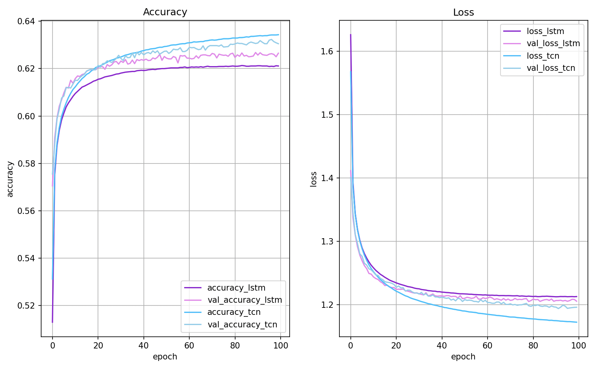

# Keras TCN

*Keras Temporal Convolutional Network*. [[paper](https://arxiv.org/abs/1803.01271)]

Tested with Tensorflow 2.6, 2.7, 2.8, 2.9 and 2.10 (Sep 2022).

[](https://pepy.tech/project/keras-tcn)
[](https://pepy.tech/project/keras-tcn)

```bash
pip install keras-tcn
pip install keras-tcn --no-dependencies  # without the dependencies if you already have TF/Numpy.
```

For MacOS M1 users: `pip install --no-binary keras-tcn keras-tcn`. The `--no-binary` option will force pip to download the sources (tar.gz) and re-compile them locally. Also make sure that `grpcio` and `h5py` are installed correctly. There are some tutorials on how to do that online.

## Why TCN (Temporal Convolutional Network) instead of LSTM/GRU?

- TCNs exhibit longer memory than recurrent architectures with the same capacity.
- Performs better than LSTM/GRU on long time series (Seq. MNIST, Adding Problem, Copy Memory, Word-level PTB...).
- Parallelism (convolutional layers), flexible receptive field size (how far the model can see), stable gradients (compared to backpropagation through time, vanishing gradients)...

<p align="center">
  
  <b>Visualization of a stack of dilated causal convolutional layers (Wavenet, 2016)</b><br><br>
</p>

## TCN Layer

### TCN Class

```python
TCN(
    nb_filters=64,
    kernel_size=3,
    nb_stacks=1,
    dilations=(1, 2, 4, 8, 16, 32),
    padding='causal',
    use_skip_connections=True,
    dropout_rate=0.0,
    return_sequences=False,
    activation='relu',
    kernel_initializer='he_normal',
    use_batch_norm=False,
    use_layer_norm=False,
    use_weight_norm=False,
    go_backwards=False,
    return_state=False,
    **kwargs
)
```

### Arguments

- `nb_filters`: Integer. The number of filters to use in the convolutional layers. Would be similar to `units` for LSTM. Can be a list.
- `kernel_size`: Integer. The size of the kernel to use in each convolutional layer.
- `dilations`: List/Tuple. A dilation list. Example is: [1, 2, 4, 8, 16, 32, 64].
- `nb_stacks`: Integer. The number of stacks of residual blocks to use.
- `padding`: String. The padding to use in the convolutions. 'causal' for a causal network (as in the original implementation) and 'same' for a non-causal network.
- `use_skip_connections`: Boolean. If we want to add skip connections from input to each residual block.
- `return_sequences`: Boolean. Whether to return the last output in the output sequence, or the full sequence.
- `dropout_rate`: Float between 0 and 1. Fraction of the input units to drop.
- `activation`: The activation used in the residual blocks o = activation(x + F(x)).
- `kernel_initializer`: Initializer for the kernel weights matrix (Conv1D).
- `use_batch_norm`: Whether to use batch normalization in the residual layers or not.
- `use_layer_norm`: Whether to use layer normalization in the residual layers or not.
- `use_weight_norm`: Whether to use weight normalization in the residual layers or not.
- `go_backwards`: Boolean (default False). If True, process the input sequence backwards and return the reversed sequence.
- `return_state`: Boolean. Whether to return the last state in addition to the output. Default: False.
- `kwargs`: Any other set of arguments for configuring the parent class Layer. For example "name=str", Name of the model. Use unique names when using multiple TCN.

### Input shape

3D tensor with shape `(batch_size, timesteps, input_dim)`.

`timesteps` can be `None`. This can be useful if each sequence is of a different length: [Multiple Length Sequence Example](tasks/multi_length_sequences.py).

### Output shape

- if `return_sequences=True`: 3D tensor with shape `(batch_size, timesteps, nb_filters)`.
- if `return_sequences=False`: 2D tensor with shape `(batch_size, nb_filters)`.


### How do I choose the correct set of parameters to configure my TCN layer?

Here are some of my notes regarding my experience using TCN:

- `nb_filters`: Present in any ConvNet architecture. It is linked to the predictive power of the model and affects the size of your network. The more, the better unless you start to overfit. It's similar to the number of units in an LSTM/GRU architecture too.
- `kernel_size`: Controls the spatial area/volume considered in the convolutional ops. Good values are usually between 2 and 8. If you think your sequence heavily depends on t-1 and t-2, but less on the rest, then choose a kernel size of 2/3. For NLP tasks, we prefer bigger kernel sizes. A large kernel size will make your network much bigger.
- `dilations`: It controls how deep your TCN layer is. Usually, consider a list with multiple of two. You can guess how many dilations you need by matching the receptive field (of the TCN) with the length of features in your sequence. For example, if your input sequence is periodic, you might want to have multiples of that period as dilations.
- `nb_stacks`: Not very useful unless your sequences are very long (like waveforms with hundreds of thousands of time steps).
- `padding`: I have only used `causal` since a TCN stands for Temporal Convolutional Networks. Causal prevents information leakage.
- `use_skip_connections`: Skip connections connects layers, similarly to DenseNet. It helps the gradients flow. Unless you experience a drop in performance, you should always activate it.
- `return_sequences`: Same as the one present in the LSTM layer. Refer to the Keras doc for this parameter.
- `dropout_rate`: Similar to `recurrent_dropout` for the LSTM layer. I usually don't use it much. Or set it to a low value like `0.05`.
- `activation`: Leave it to default. I have never changed it.
- `kernel_initializer`: If the training of the TCN gets stuck, it might be worth changing this parameter. For example: `glorot_uniform`.

- `use_batch_norm`, `use_weight_norm`, `use_weight_norm`: Use normalization if your network is big enough and the task contains enough data. I usually prefer using `use_layer_norm`, but you can try them all and see which one works the best.


### Receptive field

The receptive field is defined as: the maximum number of steps back in time from current sample at time T, that a filter from (block, layer, stack, TCN) can hit (effective history) + 1. The receptive field of the TCN can be calculated using the formula:
<p align="center">
  
</p>

where N<sub>stack</sub> is the number of stacks, N<sub>b</sub> is the number of residual blocks per stack, d is a vector containing the dilations of each residual block in each stack, and K is the kernel size. The 2 is there because there are two `Conv1d` layers in a single `ResidualBlock`.

Ideally you want your receptive field to be bigger than the largest length of input sequence, if you pass a sequence longer than your receptive field into the model, any extra values (further back in the sequence) will be replaced with zeros.

#### Examples

*NOTE*: Unlike the TCN, example figures only include a single `Conv1d` per layer, so the formula becomes R<sub>field</sub> = 1 + (K-1)⋅N<sub>stack</sub>⋅Σi di (without the factor 2).

- If a dilated conv net has only one stack of residual blocks with a kernel size of `2` and dilations `[1, 2, 4, 8]`, its receptive field is `16`. The image below illustrates it:

<p align="center">
  
  <b>ks = 2, dilations = [1, 2, 4, 8], 1 block</b><br><br>
</p>

- If a dilated conv net has 2 stacks of residual blocks, you would have the situation below, that is, an increase in the receptive field up to 31:

<p align="center">
  
  <b>ks = 2, dilations = [1, 2, 4, 8], 2 blocks</b><br><br>
</p>


- If we increased the number of stacks to 3, the size of the receptive field would increase again, such as below:

<p align="center">
  
  <b>ks = 2, dilations = [1, 2, 4, 8], 3 blocks</b><br><br>
</p>


### Non-causal TCN

Making the TCN architecture non-causal allows it to take the future into consideration to do its prediction as shown in the figure below.

However, it is not anymore suitable for real-time applications.

<p align="center">
  
  <b>Non-Causal TCN - ks = 3, dilations = [1, 2, 4, 8], 1 block</b><br><br>
</p>

To use a non-causal TCN, specify `padding='valid'` or `padding='same'` when initializing the TCN layers.

## Run

Once `keras-tcn` is installed as a package, you can take a glimpse of what is possible to do with TCNs. Some tasks examples are available in the repository for this purpose:

```bash
cd adding_problem/
python main.py # run adding problem task

cd copy_memory/
python main.py # run copy memory task

cd mnist_pixel/
python main.py # run sequential mnist pixel task
```

Reproducible results are possible on (NVIDIA) GPUs using the [tensorflow-determinism](https://github.com/NVIDIA/tensorflow-determinism) library. It was tested with keras-tcn by @lingdoc.

## Tasks

### Word PTB

Language modeling remains one of the primary applications of recurrent networks. In this example, we show that TCN can beat LSTM on the [WordPTB](tasks/word_ptb/README.md) task, without too much tuning.

<p align="center">
  <br>
  <i>TCN vs LSTM (comparable number of weights)</i><br><br>
</p>

### Adding Task

The task consists of feeding a large array of decimal numbers to the network, along with a boolean array of the same length. The objective is to sum the two decimals where the boolean array contain the two 1s.

#### Explanation

<p align="center">
  
  <b>Adding Problem Task</b><br><br>
</p>

#### Implementation results

```
782/782 [==============================] - 154s 197ms/step - loss: 0.8437 - val_loss: 0.1883
782/782 [==============================] - 154s 196ms/step - loss: 0.0702 - val_loss: 0.0111
[...]
782/782 [==============================] - 152s 194ms/step - loss: 6.9630e-04 - val_loss: 3.7180e-04
```

### Copy Memory Task

The copy memory consists of a very large array:
- At the beginning, there's the vector x of length N. This is the vector to copy.
- At the end, N+1 9s are present. The first 9 is seen as a delimiter.
- In the middle, only 0s are there.

The idea is to copy the content of the vector x to the end of the large array. The task is made sufficiently complex by increasing the number of 0s in the middle.

#### Explanation

<p align="center">
  
  <b>Copy Memory Task</b><br><br>
</p>

#### Implementation results (first epochs)

```
118/118 [==============================] - 17s 143ms/step - loss: 1.1732 - accuracy: 0.6725 - val_loss: 0.1119 - val_accuracy: 0.9796
[...]
118/118 [==============================] - 15s 125ms/step - loss: 0.0268 - accuracy: 0.9885 - val_loss: 0.0206 - val_accuracy: 0.9908
118/118 [==============================] - 15s 125ms/step - loss: 0.0228 - accuracy: 0.9900 - val_loss: 0.0169 - val_accuracy: 0.9933
```

### Sequential MNIST

#### Explanation

The idea here is to consider MNIST images as 1-D sequences and feed them to the network. This task is particularly hard because sequences are 28*28 = 784 elements. In order to classify correctly, the network has to remember all the sequence. Usual LSTM are unable to perform well on this task.

<p align="center">
  
  <b>Sequential MNIST</b><br><br>
</p>

#### Implementation results

```
1875/1875 [==============================] - 46s 25ms/step - loss: 0.0949 - accuracy: 0.9706 - val_loss: 0.0763 - val_accuracy: 0.9756
1875/1875 [==============================] - 46s 25ms/step - loss: 0.0831 - accuracy: 0.9743 - val_loss: 0.0656 - val_accuracy: 0.9807
[...]
1875/1875 [==============================] - 46s 25ms/step - loss: 0.0486 - accuracy: 0.9840 - val_loss: 0.0572 - val_accuracy: 0.9832
1875/1875 [==============================] - 46s 25ms/step - loss: 0.0453 - accuracy: 0.9858 - val_loss: 0.0424 - val_accuracy: 0.9862
```

## References
- https://github.com/locuslab/TCN/ (TCN for Pytorch)
- https://arxiv.org/pdf/1803.01271 (An Empirical Evaluation of Generic Convolutional and Recurrent Networks
for Sequence Modeling)
- https://arxiv.org/pdf/1609.03499 (Original Wavenet paper)
- - https://github.com/Baichenjia/Tensorflow-TCN (Tensorflow Eager implementation of TCNs)

## Citation

```
@misc{KerasTCN,
  author = {Philippe Remy},
  title = {Temporal Convolutional Networks for Keras},
  year = {2020},
  publisher = {GitHub},
  journal = {GitHub repository},
  howpublished = {\url{https://github.com/philipperemy/keras-tcn}},
}
```

## Contributors

<a href="https://github.com/philipperemy/keras-tcn/graphs/contributors">
  
</a>
