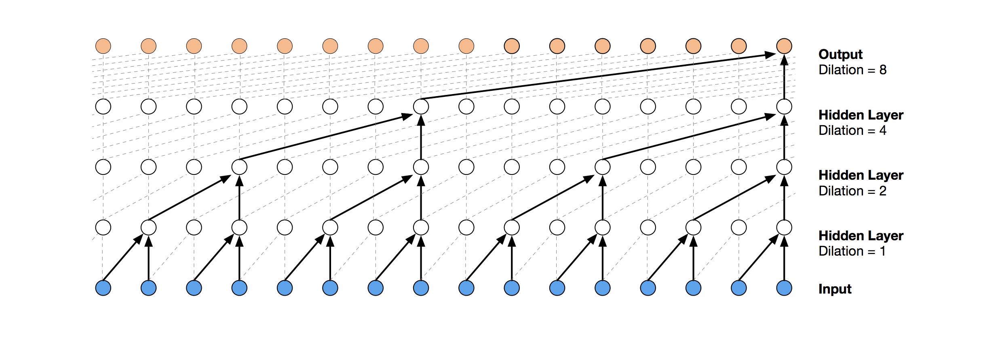
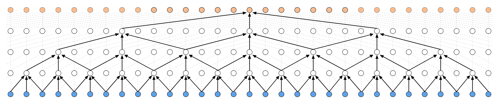
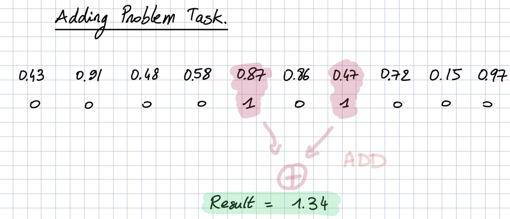
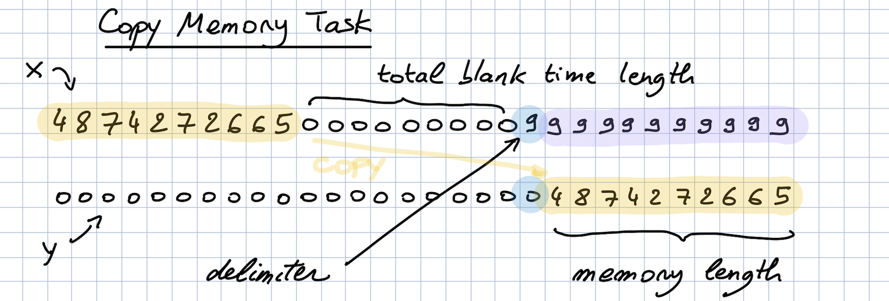
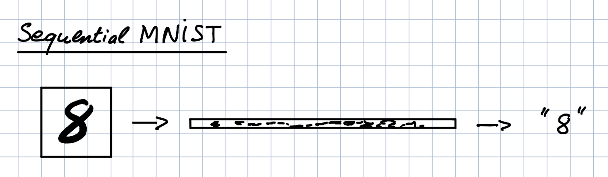

# Keras TCN


[](https://pepy.tech/project/keras-tcn)
[](https://pepy.tech/project/keras-tcn)
```bash
pip install keras-tcn
```

*Keras Temporal Convolutional Network*

   * [Keras TCN](#keras-tcn)
      * [Why Temporal Convolutional Network?](#why-temporal-convolutional-network)
      * [API](#api)
         * [Arguments](#arguments)
         * [Input shape](#input-shape)
         * [Output shape](#output-shape)
         * [Receptive field](#receptive-field)
         * [Non-causal TCN](#non-causal-tcn)
      * [Installation](#installation)
      * [Run](#run)
      * [Tasks](#tasks)
         * [Adding Task](#adding-task)
            * [Explanation](#explanation)
            * [Implementation results](#implementation-results)
         * [Copy Memory Task](#copy-memory-task)
            * [Explanation](#explanation-1)
            * [Implementation results (first epochs)](#implementation-results-first-epochs)
         * [Sequential MNIST](#sequential-mnist)
            * [Explanation](#explanation-2)
            * [Implementation results](#implementation-results-1)
      * [References](#references)

## Why Temporal Convolutional Network?

- TCNs exhibit longer memory than recurrent architectures with the same capacity.
- Constantly performs better than LSTM/GRU architectures on a vast range of tasks (Seq. MNIST, Adding Problem, Copy Memory, Word-level PTB...).
- Parallelism, flexible receptive field size, stable gradients, low memory requirements for training, variable length inputs...

<p align="center">
  
  <b>Visualization of a stack of dilated causal convolutional layers (Wavenet, 2016)</b><br><br>
</p>

## API

The usual way is to import the TCN layer and use it inside a Keras model. I provide a snippet below to illustrate it on a regression task (cf. `tasks/` for other examples):

```python
from keras.layers import Dense
from keras.models import Input, Model

from tcn import TCN

batch_size, timesteps, input_dim = None, 20, 1


def get_x_y(size=1000):
    import numpy as np
    pos_indices = np.random.choice(size, size=int(size // 2), replace=False)
    x_train = np.zeros(shape=(size, timesteps, 1))
    y_train = np.zeros(shape=(size, 1))
    x_train[pos_indices, 0] = 1.0
    y_train[pos_indices, 0] = 1.0
    return x_train, y_train


i = Input(batch_shape=(batch_size, timesteps, input_dim))

o = TCN(return_sequences=False)(i)  # The TCN layers are here.
o = Dense(1)(o)

m = Model(inputs=[i], outputs=[o])
m.compile(optimizer='adam', loss='mse')

x, y = get_x_y()
m.fit(x, y, epochs=10, validation_split=0.2)
```

In the example above, TCNs can also be stacked together, like this:

```python
o = TCN(return_sequences=True, name='TCN_1')(i)
o = TCN(return_sequences=False, name='TCN_2')(o)
```

I also provide a ready to use TCN model that can be imported and used this way (cf. `tasks/` for the full code):

```python
from tcn import compiled_tcn

model = compiled_tcn(...)
model.fit(x, y) # Keras model.
```

### Arguments

`tcn.TCN(nb_filters=64, kernel_size=2, nb_stacks=1, dilations=[1, 2, 4, 8, 16, 32], activation='norm_relu', padding='causal', use_skip_connections=True, dropout_rate=0.0, return_sequences=True, name='tcn')`

- `nb_filters`: Integer. The number of filters to use in the convolutional layers.
- `kernel_size`: Integer. The size of the kernel to use in each convolutional layer.
- `dilations`: List. A dilation list. Example is: [1, 2, 4, 8, 16, 32, 64].
- `nb_stacks`: Integer. The number of stacks of residual blocks to use.
- `activation`: String. The activations to use in the residual blocks (norm_relu, wavenet, relu...).
- `padding`: String. The padding to use in the convolutions. 'causal' for a causal network (as in the original implementation) and 'same' for a non-causal network.
- `use_skip_connections`: Boolean. If we want to add skip connections from input to each residual block.
- `return_sequences`: Boolean. Whether to return the last output in the output sequence, or the full sequence.
- `dropout_rate`: Float between 0 and 1. Fraction of the input units to drop.
- `name`: Name of the model. Useful when having multiple TCN.

### Input shape

3D tensor with shape `(batch_size, timesteps, input_dim)`.

`timesteps` can be None. This can be useful if each sequence is of a different length: [Multiple Length Sequence Example](tasks/multi_length_sequences.py).

### Output shape

It depends on the task (cf. below for examples):

- Regression (Many to one) e.g. adding problem
- Classification (Many to many) e.g. copy memory task
- Classification (Many to one) e.g. sequential mnist task

For a Many to Many regression, a cheap fix for now is to change the [number of units of the final Dense layer](https://github.com/philipperemy/keras-tcn/blob/8151b4a87f906fd856fd1c113c48392d542d0994/tcn/tcn.py#L90).

### Receptive field

- Receptive field = **nb_stacks_of_residuals_blocks * kernel_size * last_dilation**.
- If a TCN has only one stack of residual blocks with a kernel size of 2 and dilations [1, 2, 4, 8], its receptive field is 2 * 1 * 8 = 16. The image below illustrates it:

<p align="center">
  
  <b>ks = 2, dilations = [1, 2, 4, 8], 1 block</b><br><br>
</p>

- If the TCN has now 2 stacks of residual blocks, wou would get the situation below, that is, an increase in the receptive field to 32:

<p align="center">
  
  <b>ks = 2, dilations = [1, 2, 4, 8], 2 blocks</b><br><br>
</p>


- If we increased the number of stacks to 3, the size of the receptive field would increase again, such as below:

<p align="center">
  
  <b>ks = 2, dilations = [1, 2, 4, 8], 3 blocks</b><br><br>
</p>

Thanks a lot to [@alextheseal](https://github.com/alextheseal) for providing such visuals.

### Non-causal TCN

Making the TCN architecture non-causal allows it to take the future into consideration to do its prediction as shown in the figure below.

However, it is not anymore suitable for real-time applications.

<p align="center">
  
  <b>Non-Causal TCN - ks = 3, dilations = [1, 2, 4, 8], 1 block</b><br><br>
</p>

Special thanks to: [@qlemaire22](https://github.com/qlemaire22)

## Installation (Python 3)

```bash
git clone git@github.com:philipperemy/keras-tcn.git
cd keras-tcn
virtualenv -p python3.6 venv
source venv/bin/activate
pip install -r requirements.txt # change to tensorflow if you dont have a gpu.
pip install . --upgrade # install it as a package.
```

Note: Only compatible with Python 3 at the moment. Should be almost compatible with python 2.

## Run

Once `keras-tcn` is installed as a package, you can take a glimpse of what's possible to do with TCNs. Some tasks examples are  available in the repository for this purpose:

```bash
cd adding_problem/
python main.py # run adding problem task

cd copy_memory/
python main.py # run copy memory task

cd mnist_pixel/
python main.py # run sequential mnist pixel task
```

## Tasks

### Adding Task

The task consists of feeding a large array of decimal numbers to the network, along with a boolean array of the same length. The objective is to sum the two decimals where the boolean array contain the two 1s.

#### Explanation

<p align="center">
  
  <b>Adding Problem Task</b><br><br>
</p>

#### Implementation results

The model takes time to learn this task. It's symbolized by a very long plateau (could take ~8 epochs on some runs).

```
200000/200000 [==============================] - 293s 1ms/step - loss: 0.1731 - val_loss: 0.1662
200000/200000 [==============================] - 289s 1ms/step - loss: 0.1675 - val_loss: 0.1665
200000/200000 [==============================] - 287s 1ms/step - loss: 0.1670 - val_loss: 0.1665
200000/200000 [==============================] - 288s 1ms/step - loss: 0.1668 - val_loss: 0.1669
200000/200000 [==============================] - 285s 1ms/step - loss: 0.1085 - val_loss: 0.0019
200000/200000 [==============================] - 285s 1ms/step - loss: 0.0011 - val_loss: 4.1667e-04
200000/200000 [==============================] - 282s 1ms/step - loss: 6.0470e-04 - val_loss: 6.7708e-04
200000/200000 [==============================] - 282s 1ms/step - loss: 4.3099e-04 - val_loss: 7.3898e-04
200000/200000 [==============================] - 282s 1ms/step - loss: 3.9102e-04 - val_loss: 1.8727e-04
200000/200000 [==============================] - 280s 1ms/step - loss: 3.1040e-04 - val_loss: 0.0010
200000/200000 [==============================] - 281s 1ms/step - loss: 3.1166e-04 - val_loss: 2.2333e-04
200000/200000 [==============================] - 281s 1ms/step - loss: 2.8046e-04 - val_loss: 1.5194e-04
```

### Copy Memory Task

The copy memory consists of a very large array:
- At the beginning, there's the vector x of length N. This is the vector to copy.
- At the end, N+1 9s are present. The first 9 is seen as a delimiter.
- In the middle, only 0s are there.

The idea is to copy the content of the vector x to the end of the large array. The task is made sufficiently complex by increasing the number of 0s in the middle.

#### Explanation

<p align="center">
  
  <b>Copy Memory Task</b><br><br>
</p>

#### Implementation results (first epochs)

```
30000/30000 [==============================] - 30s 1ms/step - loss: 0.1174 - acc: 0.9586 - val_loss: 0.0370 - val_acc: 0.9859
30000/30000 [==============================] - 26s 874us/step - loss: 0.0367 - acc: 0.9859 - val_loss: 0.0363 - val_acc: 0.9859
30000/30000 [==============================] - 26s 852us/step - loss: 0.0361 - acc: 0.9859 - val_loss: 0.0358 - val_acc: 0.9859
30000/30000 [==============================] - 26s 872us/step - loss: 0.0355 - acc: 0.9859 - val_loss: 0.0349 - val_acc: 0.9859
30000/30000 [==============================] - 25s 850us/step - loss: 0.0339 - acc: 0.9864 - val_loss: 0.0291 - val_acc: 0.9881
30000/30000 [==============================] - 26s 856us/step - loss: 0.0235 - acc: 0.9896 - val_loss: 0.0159 - val_acc: 0.9944
30000/30000 [==============================] - 26s 872us/step - loss: 0.0169 - acc: 0.9929 - val_loss: 0.0125 - val_acc: 0.9966
```

### Sequential MNIST

#### Explanation

The idea here is to consider MNIST images as 1-D sequences and feed them to the network. This task is particularly hard because sequences are 28*28 = 784 elements. In order to classify correctly, the network has to remember all the sequence. Usual LSTM are unable to perform well on this task.

<p align="center">
  
  <b>Sequential MNIST</b><br><br>
</p>

#### Implementation results

```
60000/60000 [==============================] - 118s 2ms/step - loss: 0.2348 - acc: 0.9265 - val_loss: 0.1308 - val_acc: 0.9579
60000/60000 [==============================] - 116s 2ms/step - loss: 0.0973 - acc: 0.9698 - val_loss: 0.0645 - val_acc: 0.9798
[...]
60000/60000 [==============================] - 112s 2ms/step - loss: 0.0075 - acc: 0.9978 - val_loss: 0.0547 - val_acc: 0.9894
60000/60000 [==============================] - 111s 2ms/step - loss: 0.0093 - acc: 0.9968 - val_loss: 0.0585 - val_acc: 0.9895
```


## References
- https://github.com/locuslab/TCN/ (TCN for Pytorch)
- https://arxiv.org/pdf/1803.01271.pdf (An Empirical Evaluation of Generic Convolutional and Recurrent Networks
for Sequence Modeling)
- https://arxiv.org/pdf/1609.03499.pdf (Original Wavenet paper)

### Repo views (since 2018/10/30)
[](http://hits.dwyl.io/philipperemy/keras-tcn)
